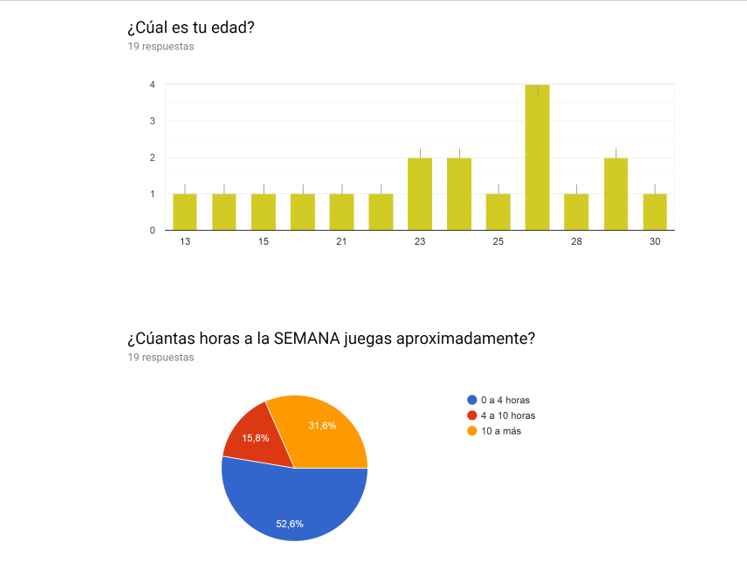
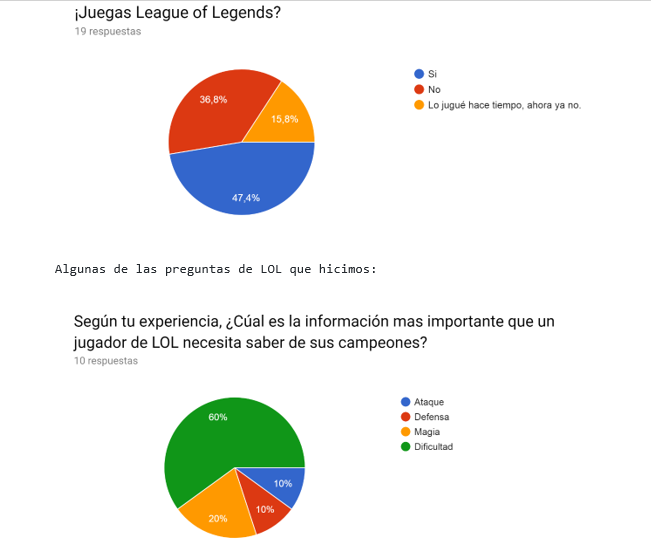
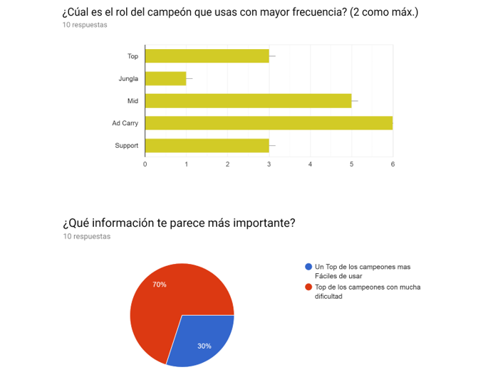
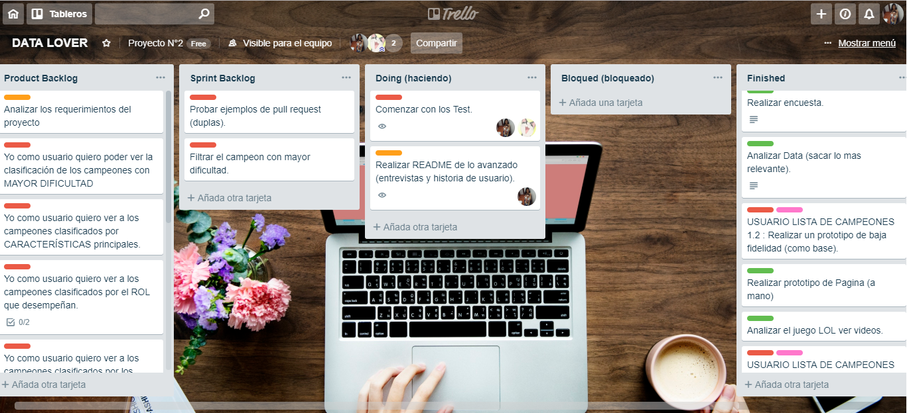
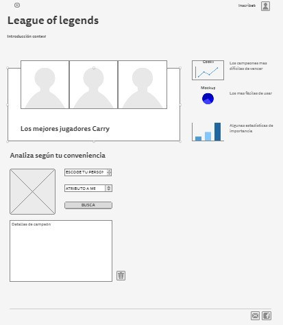
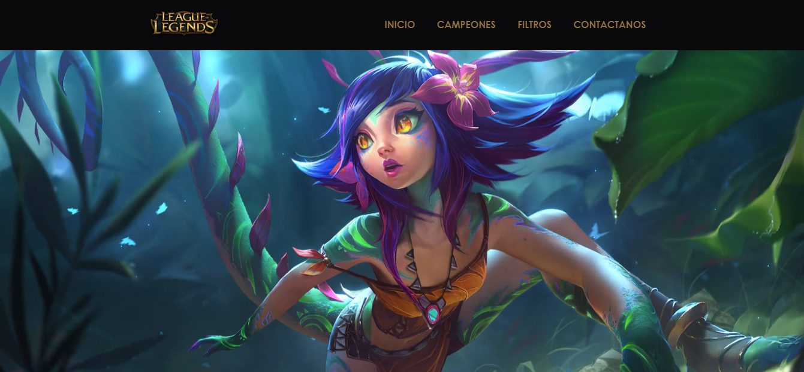
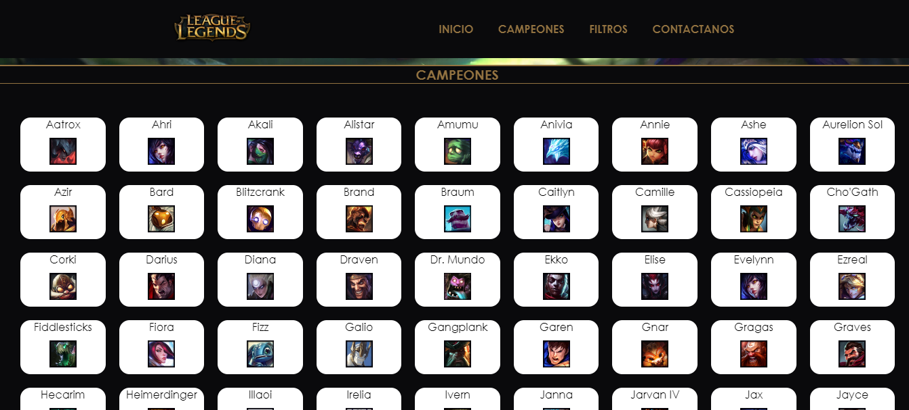
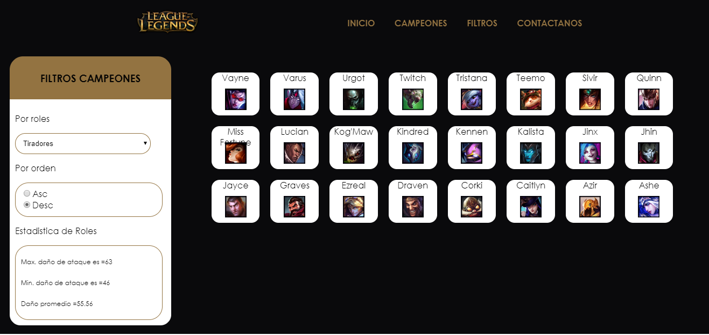
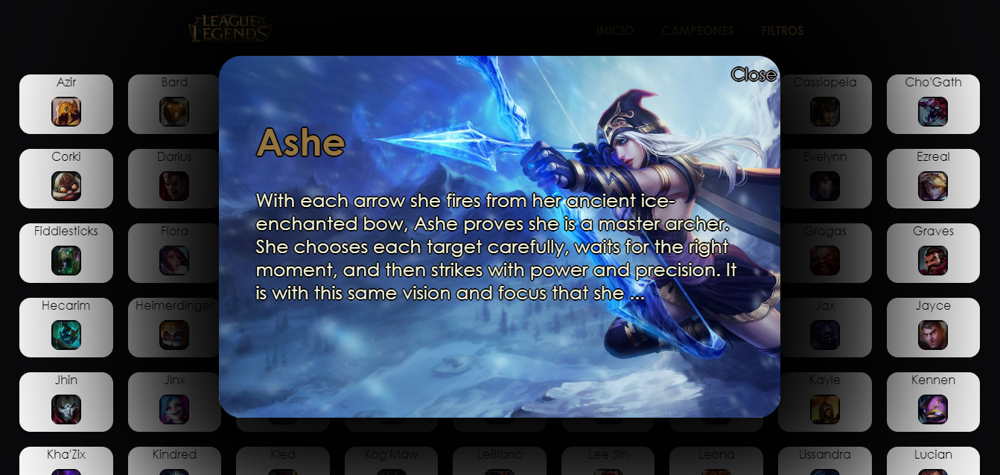

# Data Lovers - LOL(League of Legends)
***
<<<<<<< HEAD
## Índice
* [Proyecto](#proyecto)
* [Descripción del Juego](#temática-Elegida)
* [Usuarios](#principales-usuarios)
* [Objetivos](#objetivos-del-usuario)
* [Historias de Usuario](#historias-de-usuario)
* [Uso del producto](#¿Cuándo-se-utilizaría-el-producto?)
* [La Solución a sus necesidades](#solución-al-problema)
* [Desarrolo del Proyecto](#desarrollo-del-proyecto)
## Proyecto
El presente proyecto es el segundo a realizar en el Bootcamp 2018-2, y está basado en _procesar_, _filtrar_ y _ordenar_ la data, así como _calcular_ estadísticas.
En el mundo de la web es muy común el uso de data. De hecho, wikipedia nos dice que un dashboard puede ser un resumen gráfico de varias piezas de información importante, generalmente utilizadas para dar una visión general de una empresa o de un servicio.
Además, este proyecto se debe "resolver" en parejas, por lo que un objetivo importante es ganar experiencia en trabajos colaborativos con entrega grupal.
## Temática Elegida
[League of Legends](https://lan.leagueoflegends.com/es/game-info/get-started/what-is-lol/) (también conocido por sus siglas LoL) es un videojuego del juego de género multiplayer online battle arena (MOBA) y deporte electrónico desarrollado por Riot Games para Microsoft Windows y OS X.
Fue diseñado para el sistema operativo Microsoft Windows y lanzaron una beta para OS X dejando al poco tiempo el proyecto de lado. Esta beta ha sido mejorada por parte de usuarios del juego, haciendo posible jugar a una versión actualizada de League of Legends.
**El juego está inspirado en un popular mapa personalizado del Warcraft III**, Defense of the Ancients: Allstars diseñado por Steve «Guinsoo» Feak el cual a su vez está basado en el escenario de StarCraft «Aeon of Strife».

## Principales Usuarios
Los principales usuarios son los jugadores tanto nuevos como antiguos de League of Legends (LOL), quienes al jugar siempre seleccionan a un campeón sin conocer sus ventajas y desventajas, al menos que ya lleven jugando con el mismo campeón muuuucho tiempo; pero es imposible poder lograr jugar con todos los campeones y así conocerlos, ¡es ahí donde entramos nosotras!
## Objetivos del Usuario
Los objetivos del usuario es tener una interfaz web donde pueda visualizar y manipular data a su conveniencia para así poder usarlo a su favor mientras juegue; pueda conocer ventajas y desventajas de cada jugador mediante tablas gráficos y estadísticas.
Por ello, es muy importante pensar en el usuario, entender cuál es la mejor manera de visualizar la data según sus necesidades, y plasmar todo eso en nuestro diseño web.
## Historias de Usuario
Se realizaron **encuestas online** a los usuarios involucrados en videojuegos, con la finalidad de conocer datos generales, luego se profundizaron con preguntas de LOL solo a los que lo jugaban actualmente, para conocer las necesidades que ellos tenían, y los requerimientos que necesitaban implementarse en la plataforma web.
Para la encuesta, se preparó una lista de preguntas, y a su vez se diseñó 1 prototipo básico, adaptándolo siempre a las necesidades del usuario.
Algunas de las preguntas generales que hicimos:

### Historias de Usuario generadas
*   Como jugador de LOL me gustaría saber quiénes son los campeones por medio de una imagen y ordenadamente para poder reconocerlos.
*   Como jugador de LOL me gustaría poder filtrar los campeones por Rol, para conocer sus habilidades.
*   Como jugador de LOL me gustaría tener una estadística adicional sobre los ataques.
*   Como jugador de LOL me gustaría ver las características de los campeones, para así poder conocer quién es el mejor según sus puntajes
## ¿Cuándo se utilizaría el producto?
El producto lo pueden usar tanto como novatos desde un inicio o jugadores antiguos que ya conocen mas de la plataforma, para que así viendo las datas de los campeones puedan elegir el de su mayor conveniencia para un juego más atractivo.
## Solución al problema y necesidades del Usuario
Después de conocer a los principales usuarios y entender sus necesidades, se llegó a la decisión de construir una interfaz web que permita visualizar y manipular data,aplicando asi todas las historias de usuario que logramos recopilar gracias a los testeos y encuestas; de esta manera se resolvería en gran manera las necesidades del usuario.
## Desarrollo del Proyecto
### *PRIMER SPRINT*
1) Tareas compartidas y organización mediante Trello.

2) Sketch de la solución (prototipo de baja fidelidad).

3) Resultados del primer Sprint
- Barra de Menú integrada.
- Fondo de pantalla (video interactivo).
- Manejo pequeño de Responsive.

=======

## Preámbulo

Según un [estudio de IBM](https://www-01.ibm.com/common/ssi/cgi-bin/ssialias?htmlfid=WRL12345USEN),
el 90% de la data que existe hoy ha sido creada durante los últimos dos años.
Cada día generamos 2.5 trillones de bytes de datos, una cifra sin precedentes.

No obstante, los datos por sí mismos son de poca utilidad. Para que esas
grandes cantidades de datos se conviertan en **información** fácil de leer para
los usuarios, necesitamos entender y procesar estos datos. Una manera simple de
hacerlo es creando _interfaces_ y _visualizaciones_.

En la siguiente imagen, podrás ver cómo con la data que que se ve en la parte
izquierda se puede construir una interfaz amigable y entendible por el usuario.

\* Puedes ver el datalle de la data en este [link](https://gist.github.com/lalogf/dd4aa3017a9f8aa8f90dfbca382c4dc9#file-student-json)
y la interfaz construida en este [link](https://app.talento.laboratoria.la/profile/HFOoMpOreBU2psCcjjLg5O2EWEv2).

## Resumen del proyecto

En este proyecto **construirás una _página web_ para visualizar un
_conjunto (set) de datos_** que se adecúe a lo que descubras que tu usuario
necesita.

Esta vez te proponemos una serie de datos de diferentes _temáticas_ para que
explores y decidas con qué temática te interesa trabajar. Hemos elegido
específicamente estos sets de datos porque creemos que se adecúan bien a esta
etapa de tu aprendizaje.

Una vez que definas tu área de interés, entiende quién es tu usuario y qué
necesita saber o ver exactamente; luego podrás construir la interfaz que le
ayude a interactuar y entender mejor esos datos.

Estos son datos que te proponemos:

* Indicadores de desarrollo del Banco Mundial de algunos países (Brasil, Chile, 
  México y Perú). Estos datos incluyen indicadores demográficos, económicos y 
  comerciales.
* [Pokémon](src/data/pokemon/pokemon.json):
  En este set encontrarás una lista con los 151 Pokémon de la región de Kanto,
  junto con sus respectivas estadísticas usadas en el juego [Pokémon GO](pokemongolive.com).
* [Steam noticias](src/data/steam/steam.json):
  Lista noticias relacionadas a los videojuegos presentes en la
  plataforma de [Steam](https://store.steampowered.com/).
* [League of Legends - Challenger leaderboard](src/data/lol/lol.json):
  Este set de datos muestra la lista de jugadores en una liga del
  juego League of Legends (LoL), puedes revisar la documentación de su API en
  este [link](https://developer.riotgames.com/api-methods/).
* [Personas heridas por medio de transporte en EEUU](src/data/injuries/injuries.json).
  Este set nos muestra el número de personas heridas en accidentes de
  transporte, con data anual desde 1960 y categorizada por tipo de transporte
  (aire, barco, automóvil, moto, bicileta, ...).

Como entregable final tendrás una página web que permita **visualizar la data,
filtrarla, ordenarla y hacer algún calculo agregado**. Como aclaración,
con cálculo agregado nos referimos a distintos cálculos que puedes hacer con
la data que tienes para mostrar información aún más relevante a los usuarios.
Una opción serían cálculos estadísticos como el promedio, el máximo o el mínimo,
por ejemplo, si tenemos una colección que representa a un grupo de personas,
y cada persona está representada como un _objeto_ con una _propiedad_ `altura`,
podríamos elegir calcular la altura promedio en el grupo entre otras cosas.

Cada set de datos tiene una identidad gráfica que deberás utilizar en la
interfaz. La identidad gráfica; o también conocido como guía de estilos en
diseño, de cada set la podrás encontrar en el siguiente
[link](https://drive.google.com/open?id=1eeWFqrWpy-OYOH4EHDckFGunyrm9iNeE).

## Consideraciones generales

* Este proyecto se debe resolver en duplas.
* El proyecto será entregado subiendo tu código a GitHub (commit/push) y la
  interfaz será desplegada usando [GitHub Pages](https://pages.github.com/).
* Tiempo para completarlo: Toma como referencia 3 semanas. Trabaja durante el
  primer Sprint (una semana) y al  final, decide en cuántas semanas lo
  terminarás.

## Objetivos de aprendizaje

El objetivo principal de este proyecto es que aprendas a diseñar y construir una
interfaz web donde se pueda visualizar y manipular data, entendiendo lo que el
usuario necesita.

Dicho en palabras sencillas, aprenderás a:

* Aplicar y profundizar todo lo que aprendiste en el proyecto anterior.
* Pensar en las **necesidades de los usuarios** para crear historias de usuario.
* Escribir y trabajar con **historias de usuario**, sus definiciones de
  terminado (_definition of done_) en la organización y planificación de tu
  trabajo.
* Definir qué data y de qué forma mostrarla en el producto, basándote en
  tu **entendimiento del usuario**.
* Crear productos que sigan los **principios básicos de diseño visual** y
  las **heurísticas de usabilidad**.
* Iterar el diseño del producto, basándote en los resultados de los
  **tests de usabilidad**.
* Manipular **_arreglos_ (_arrays_) y _objetos_ (_objects_)**.
* **Manipular el DOM** (agregar elementos dinámicamente basados en la data).
* **Manejar eventos del DOM** para permitir interacción con el usuario
  (filtrado, ordenado, ...).
* Entender los beneficios y complejidades de **trabajar en equipo** en un
  ambiente de incertidumbre.

## Parte Obligatoria

Los criterios para considerar que has completado este proyecto son:

### Definición del producto

Documenta brevemente tu trabajo en el archivo `README.md` de tu repositorio,
contándonos cómo fue tu proceso de diseño y cómo crees que el producto resuelve
el problema (o problemas) que tiene tu usuario.

### Historias de usuario

Una vez que entiendas las necesidades de tu usuario, escribe las [Historias
de Usuario](https://es.wikipedia.org/wiki/Historias_de_usuario) que representen
todo lo que el usuario necesita hacer/ver. Asegúrate de incluir una definición
de terminado (_definition o done_) para cada una.

### Diseño de la Interfaz de Usuario

#### Prototipo de baja fidelidad

Durante tu trabajo deberás haber hecho e iterado sketches (boceto) de tu
solución usando papel y lápiz. Te recomendamos tomar fotos de todas las
iteraciones que realices, y las subas a tu repositorio, y las menciones en tu
`README.md`.

#### Prototipo de alta fidelidad

Lo siguiente es diseñar tu Interfaz de Usuario (UI por sus siglas en inglés -
_User Interface_). Para eso debes aprender a utilizar alguna herramienta de
diseño visual. Nosotros te recomendamos [Figma](https://www.figma.com/) que es
una herramienta que funciona en el navegador y, además, puedes crear una cuenta
gratis. Sin embargo, eres libre de utilizar otros editores gráficos como
Illustrator, Photoshop, PowerPoint, Keynote, etc. Recuerda utilizar la identidad
gráfica correspondiente a cada set de datos que elijas.

El diseño debe representar el _ideal_ de tu solución. Digamos que es lo que
desearías implementar si tuvieras tiempo ilimitado para hackear. Además, tu
diseño debe seguir los fundamentos de _visual design_. También, deberás exportar
tu diseño a [Zeplin](https://zeplin.io/) y utilizar las especificaciones de
estilo que te dé Zeplin al momento de implementar tus diseños en código.

>>>>>>> 62cdbd37178e7f5270318674305e4435f402f414
#### Testeos de usabilidad
- Al usuario le gusto mucho el fondo en movimiento, pero le gustaria que los campeones se muestren mas ordenados.
- Al usuario le encantaria que tenga una mejor visibilidad en cualquiera de sus dispositivos.
- Al usurario le gustaria ver el menu con letra mas grande.
### *SEGUNDO SPRINT*
Trabajamos en la primera historia de Usuario: Yo como usuario quiero ver los campeones de manera ordenada (nombre e imagen).
Se inició con un manejo del Responsive básico.
Trabajamos un segundo prototipado de baja fidelidad.

#### Testeos de usabilidad
- Al usuario le gusto la manera ordenada en que se muestra a los campeones y la fácil visibilidad. Le gustaria si se pudiese mostrar un poquito mas grande y su nombre también mas grande.
- Al usuario le gustaria poder observar más caractarísticas de su campeon favorito.
- Al usuario le gustaria poder clasificar a sus campeones.
### *TERCER SPRINT*
Trabajamos la segunda historia de Usuario: Yo como usuario quiero poder filtrar a los campeones según su Rol (ordenándolos según orden ascendente y descendente).
Se trabajó en una estadística de ataque según el grupo de campeones por Rol. (promedios).
1) Sketch del tercer sprint (prototipo de alta fidelidad).
Luego de los testeos de usabilidad, decidimos tratar de implementar algunas de las recoemndaciones y realizar un nuevo prototipado usando el figma - [INGRESA AQUI](https://www.figma.com/proto/H0kSz5zHLpT4zNCKe78ca18g/LOL?node-id=16%3A498&viewport=-356%2C1026%2C0.44939&scaling=min-zoom).
Implementamos el Zeplin - [INGRESA AQUÍ](https://app.zeplin.io/project/5c33eafa7fe57c0c905da306).
2)Resultado del tercer sprint:

INCORPORAMOS UN MODAL POR CADA CAMPEON CON UNA BREVE DESCRIPCIÓN.

#### Testeos de usabilidad
- Al usuario le gusto mucho poder filtrar a sus campeones según sus roles y la manera ordenada en la que se presentaba.
- Al usuario le gusto mucho poder ver la estadística de los ataques según rol, pero le gustaría saber el ataque de cada uno.
### COLABORADORAS:
1.  [Giuliana Mendoza Suma](https://github.com/GiulianaMS).
2.  [Cinthia Vilcachagua Ccorimanya](https://github.com/CinthiaVilcachagua).
